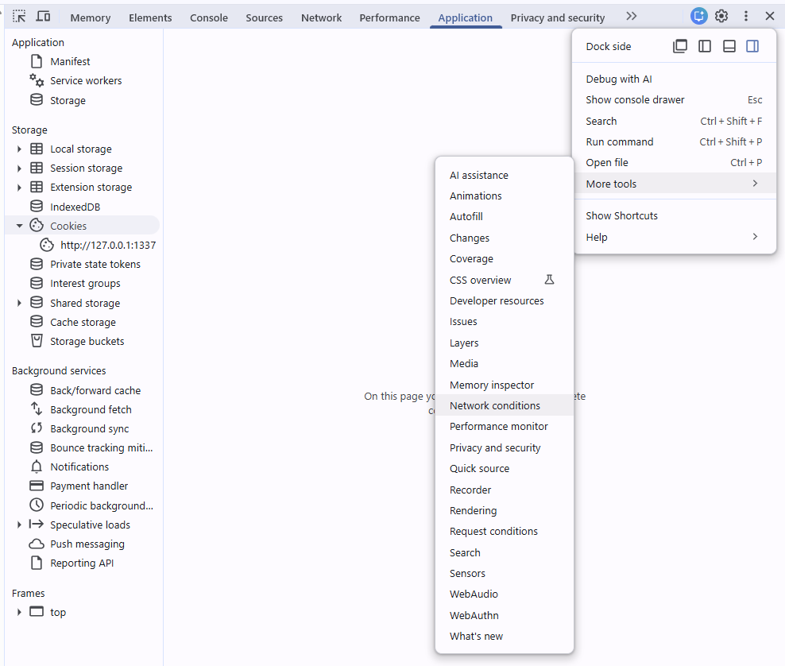
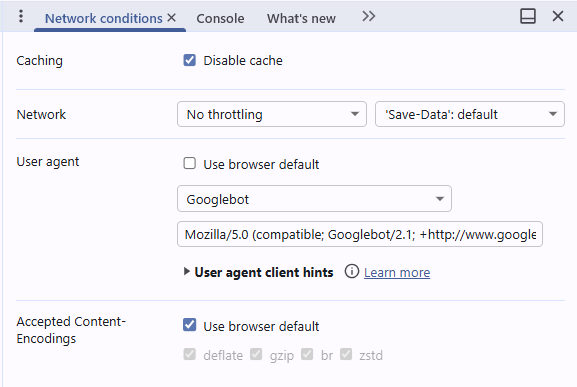

# Unshadow IT

Repositório contendo o material utilizado na palestra "Unshadow IT: Exposing the Hidden Infrastructure"

Demonstração prática de técnicas para **descoberta de ativos e detecção de vulnerabilidades (CVEs)** em ambientes corporativos, com foco nas ferramentas do **ProjectDiscovery**.

## Ecossistema ProjectDiscovery

| Recurso | Link |
| --- | --- |
| Documentação oficial | <https://docs.projectdiscovery.io/opensource> |
| Repositórios no GitHub | <https://github.com/projectdiscovery> |
| Comunidade Discord | <https://discord.gg/projectdiscovery> |

## Ambiente de Demonstração

### Serviços Web Vulneráveis (HTTP)

Os serviços abaixo são executados **apenas em localhost (127.0.0.1)**:

- **Apache Tomcat (CVEs conhecidas)**
  <http://127.0.0.1:8990>

- **Apache Struts2 – S2-045 (CVE-2017-5638)**
  <http://127.0.0.1:8088>

- **Spring WebMVC (Spring4Shell – CVE-2022-22965)**
  <http://127.0.0.1:8089>

### CVE-2025-32463 – Sudo chroot Privilege Escalation

Containers para demonstração de escalonamento de privilégios local via `sudo --chroot`:

- **vulnerable-sudo-target** – sudo 1.9.14 (versão afetada)
- **patched-sudo-target** – sudo >= 1.9.17p1 (versão corrigida)

## Iniciando os Containers

> ℹ️ Pressupõe que o Docker e o Docker Compose estão instalados e configurados no ambiente.

```bash
docker compose up --build -d
```

## Seção 1 – Descoberta de Ativos Web

### Passo 0 – Enumeração de Subdomínios (`subfinder`)

```bash
subfinder -all -d example.com -oJ -cs -oI -nW -o subdomains.txt
```

| Flag | Descrição |
| --- | --- |
| `-all` | Usa todas as fontes de enumeração |
| `-d` | Domínio alvo |
| `-oJ` | Saída em JSON |
| `-cs` | Inclui a fonte de cada subdomínio no output |
| `-oI` | Inclui endereços IP |
| `-nW` | Filtra apenas domínios ativos (no-wildcard) |

---

`targets.txt` é o arquivo de entrada com os alvos do laboratório. O `httpx` valida quais estão ativos e grava o resultado em `lab-web.txt`, que serve de entrada para o Nuclei.

### Passo a passo

```bash
# 1. Validar ativos vivos
httpx -l targets.txt -o lab-web.txt

# 2a. Detectar tecnologias
nuclei -tags tech -l lab-web.txt

# 2b. CVEs (por tags) ou ID (específica)
nuclei -tags cve -l lab-web.txt
nuclei -id CVE-2013-2251 -l lab-web.txt -o results.txt
```

### Em pipeline (sem arquivo intermediário)

```bash
httpx -l targets.txt | nuclei -tags tech,cve
```

## Seção 2 – CVE-2025-32463: Sudo chroot Privilege Escalation

**Severity:** Critical (CVSS 9.3)
**Descrição:** Sudo antes da versão 1.9.17p1 permite que usuários locais obtenham acesso root porque o arquivo `/etc/nsswitch.conf` é lido a partir de um diretório controlado pelo atacante quando a opção `--chroot` (`-R`) é utilizada.

### Pré-requisito: Assinar o Template Nuclei

O template usa o engine `code`, que requer assinatura. O template já está assinado no repositório. Caso precise reassinar:

**Git Bash / Linux / macOS:**

```bash
cd CVE-2025-32463
bash sign-template.sh
```

**PowerShell:**

```powershell
cd CVE-2025-32463
.\sign-template.ps1
```

**Manualmente:**

```bash
nuclei -t CVE-2025-32463/templates/cve-2025-32463.yaml -sign
```

> Na primeira execução o Nuclei criará as chaves de assinatura em `%APPDATA%\nuclei\keys`.

### Executar Detecção com Nuclei

**No container vulnerável (deve detectar a CVE):**

```bash
docker exec -u testuser vulnerable-sudo-target nuclei -itags local -t /tmp/template.yaml -target localhost -code
```

**No container corrigido (não deve detectar):**

```bash
docker exec -u testuser patched-sudo-target nuclei -itags local -t /tmp/template.yaml -target localhost -code
```

### Saída Esperada

**Container vulnerável:**

```text
[CVE-2025-32463] [code] [critical] localhost ["VULNERABLE UID=1000 EUID=0"]
[INF] Scan completed. 1 matches found.
```

**Container corrigido:**

```text
[INF] Scan completed. No results found.
```

### Teste Manual do Exploit (sem Nuclei)

```bash
docker exec -it -u testuser vulnerable-sudo-target bash /tmp/exploit.sh
```

> ⚠️ Este script abre um shell root real. Use apenas no container isolado.

#### Saída Esperada do Exploit Manual

```text
woot!
root@vulnerable:/#
```

Para sair do shell, use `exit` ou `Ctrl+D`.

## Seção 3 – Templates Nuclei Personalizados

Templates de demonstração para diferentes protocolos e técnicas do Nuclei, localizados na pasta [`templates/`](templates/).

### Iniciar os Containers de Suporte

Caso não estejam rodando, inicie os containers para as demonstrações de HTTP e SMTP:

```bash
# Servidor PHP + servidor SMTP fake
docker compose up -d nuclei-target mailcatcher
```

| Serviço | Endereço | Descrição |
| --- | --- | --- |
| `nuclei-target` | `http://127.0.0.1:1337` | Servidor PHP com páginas de teste |
| `mailcatcher` | `127.0.0.1:1025` | SMTP fake + UI em `http://localhost:1080` |

### PII Extractor – Detecção de Dados Pessoais

Extrai dados pessoais expostos em páginas web: CPF, CNPJ, cartão Visa, e-mail e telefone.

```bash
nuclei -t templates/pii-extractor.yaml -u http://127.0.0.1:1337/contact.php
```

> ℹ️ Os dados, apesar de fictícios, seguem os formatos reais para demonstração.

**Saída esperada:**

```text
[pii-extractor:cc_visa]  [http] [info] http://127.0.0.1:1337/contact.php ["4485125960978105"]
[pii-extractor:cpf]      [http] [info] http://127.0.0.1:1337/contact.php ["276.713.525-51","000.111.222-00","932526535-40","77381813203"]
[pii-extractor:email]    [http] [info] http://127.0.0.1:1337/contact.php ["foo@example.com","nobody.anyplace@server.local"]
[pii-extractor:cnpj]     [http] [info] http://127.0.0.1:1337/contact.php ["85.455.186/0001-26"]
[pii-extractor:telefone] [http] [info] http://127.0.0.1:1337/contact.php ["+55 (35) 3374-4454","(95) 98247-4176"]
[INF] Scan completed. 5 matches found.
```

### Version Check – Comparação por Arquivo

Detecta versões desatualizadas comparando a versão detectada na página com a versão de referência em [`templates/_outdated-file.txt`](templates/_outdated-file.txt).

```bash
nuclei -t templates/_outdated-file.yaml -u http://127.0.0.1:1337 -V last_version=2.0.0
```

> O site anuncia `version 1.2.5` — abaixo da referência `2.0.0`.

**Saída esperada:**

```text
[base_template_comparison:outdated_version] [http] [info] http://127.0.0.1:1337 ["1.2.5"] [last_version="2.0.0"]
[INF] Scan completed. 1 matches found.
```

### Version Check – Comparação por Changelog (VCS)

Detecta a versão atual na página inicial e busca a versão mais recente no arquivo `/changelog.md` servido pelo mesmo host.

```bash
nuclei -t templates/_outdated-vcs.yaml -u http://127.0.0.1:1337
```

**Saída esperada:**

```text
[base_template_comparison:internal_detected_version] [http] [info] http://127.0.0.1:1337 ["1.2.5"]
[INF] Scan completed. 1 matches found.
```

### Workflow – Compartilhamento de Variáveis entre Steps

Demonstra workflows de dois passos: o Step 1 acessa `/workflow-step1.php`, extrai uma flag em Base64 e passa o valor capturado como parâmetro para o Step 2 (`/workflow-step2.php?flag=...`).

```bash
nuclei -w templates/_workflow_template.yaml -u http://127.0.0.1:1337
```

**Saída esperada:**

```text
[workflow-template-step2:description] [http] [info] http://127.0.0.1:1337/workflow-step2.php?flag=d29ya2Zsb3cgZmxhZyBjYXB0dXJlZCE= ["workflow flag captured!"]
[INF] Scan completed. 1 matches found.
```

### Network – Comunicação Raw TCP/SMTP

Envia uma sequência de comandos SMTP diretamente via TCP (protocolo `tcp:` do Nuclei v3) e valida se o servidor aceita a mensagem (`250 Message accepted`). O template usa `read:` entre cada comando para aguardar a resposta do servidor antes de enviar o próximo, e `part: raw` no matcher para checar a resposta acumulada completa.

```bash
# Contra o Mailcatcher (porta 1025)
nuclei -t templates/_network_template.yaml -u 127.0.0.1:1025
```

**Saída esperada:**

```text
[network_template:response] [tcp] [info] 127.0.0.1:1025 ["354 Send it","250 Message accepted","221 Ok","","220 EventMachine SMTP Server","250 Ok EventMachine SMTP Server","250 Ok"]
[INF] Scan completed. 1 matches found.
```

> ℹ️ As mensagens recebidas podem ser visualizadas em `http://localhost:1080` (Mailcatcher).

---

### Headless – Interação com Browser

Navega até `/headless.php`, clica em um botão via XPath e extrai o valor do campo `#txt_height` e os cookies da sessão.

```bash
nuclei -headless -t templates/_headless_template.yaml -u http://127.0.0.1:1337
```

**Saída esperada:**

```text
[headless_template] [headless] [unknown] http://127.0.0.1:1337/headless.php ["1080","[http://127.0.0.1:1337/headless.php PHPSESSID=...; SecretCookie=SECRET_VALUE]"]
[INF] Scan completed. 1 matches found.
```

### SEO Cloaking – Detecção por Títulos, Tamanho e Keywords

Detecta SEO cloaking comparando as respostas de um browser Desktop, Googlebot, iPhone e Android. Dispara quando há divergência de título, diferença de tamanho de corpo acima de 1KB ou presença de palavras-chave suspeitas (casino, betting, viagra etc.) nas respostas de bot/mobile.

Você pode testar contra a página de demonstração em `http://127.0.0.1:1337/seo-cloaking.php`, que serve conteúdo diferente para cada user-agent e inclui keywords de spam para simular um site de cloaking.

No navegador Google Chrome, use as DevTools (F12) para simular os diferentes user-agents e observar as mudanças de conteúdo.



Selecione a ferramenta Network Conditions e desmaque o checkbox "Use browser default". Mude para Googlebot, recarrege a página (F5) e veja o título e o corpo mudarem, além das keywords de spam aparecerem.



```bash
nuclei -t templates/seo-cloaking-detector.yaml -u http://127.0.0.1:1337/seo-cloaking.php
```

**Saída esperada:**

```text
[seo-cloaking-detection:title_mismatch]     [http] [info] http://127.0.0.1:1337/seo-cloaking.php ["[Desktop] Empresa Legítima ... | [Crawler] Melhor Casino Online ...", "[Desktop] 1454B | [Crawler] 7845B | [iPhone] 6562B | [Android] 6562B", "Keywords: casino betting viagra poker slots"]
[seo-cloaking-detection:body_size_mismatch] [http] [info] http://127.0.0.1:1337/seo-cloaking.php [...]
[seo-cloaking-detection:spam_keywords]      [http] [info] http://127.0.0.1:1337/seo-cloaking.php [...]
[INF] Scan completed. 3 matches found.
```

## Seção 4 – Templates DNS do Nuclei

Templates oficiais do Nuclei para análise de DNS e registro de domínios. Referenciados pelo ID via `-id` (sem necessidade de arquivo local).

### DNS Rebinding – Domínios que Resolvem para IPs Privados

Detecta domínios cujo DNS resolve para endereços IP privados (RFC1918: `10.x.x.x`, `172.16–31.x.x`, `192.168.x.x`), padrão central em ataques de DNS rebinding onde um atacante manipula o TTL para trocar um IP público por um IP interno.

> O Nuclei usa seu próprio resolver de DNS por padrão (não lê o `hosts`). A flag `-sr` força o uso do resolver do sistema operacional, que respeita o arquivo `hosts`.

#### Sem Detecção — IP Público

O domínio `ricardomaia.eti.br` resolve normalmente para `76.76.21.21`:

```bash
nuclei -id dns-rebinding -u ricardomaia.eti.br -sr
```

```text
[INF] Scan completed. No results found.
```

#### Com Detecção — Simulação Local via Arquivo `hosts`

Sobrescreva a resolução do domínio adicionando uma entrada no arquivo `hosts`:

**Windows** — `C:\Windows\System32\drivers\etc\hosts`:

```text
192.168.1.1 ricardomaia.eti.br
```

**Linux / macOS** — `/etc/hosts`:

```text
192.168.1.1 ricardomaia.eti.br
```

Execute o scan com `-sr` para que o Nuclei use o resolver do sistema (que lê o `hosts`):

```bash
nuclei -id dns-rebinding -u ricardomaia.eti.br -sr
```

**Saída esperada:**

```text
[dns-rebinding:IPv4] [dns] [unknown] ricardomaia.eti.br ["192.168.1.1"]
[INF] Scan completed. 1 matches found.
```

> Restaure a entrada do `hosts` após a demonstração. Loopback (`127.x.x.x`) **não** é detectado por este template — use apenas IPs RFC1918.

#### Alternativa sem Alterar o `hosts` — nip.io

O serviço [nip.io](https://nip.io) resolve qualquer subdomínio para o IP embutido no nome, dispensando configuração local:

```bash
nuclei -id dns-rebinding -u 192.168.1.1.nip.io
```

```text
[dns-rebinding:IPv4] [dns] [unknown] 192.168.1.1.nip.io ["192.168.1.1"]
[INF] Scan completed. 1 matches found.
```

### RDAP WHOIS – Consulta de Registro de Domínio

Consulta o serviço RDAP (Registration Data Access Protocol) e extrai informações estruturadas de registro: status, nameservers, datas e configuração DNSSEC.

```bash
nuclei -id rdap-whois -u example.com
```

**Saída esperada:**

```text
[rdap-whois:nameServers]      [http] [info] https://rdap.verisign.com/.../example.com ["NS1.EXAMPLE.COM","NS2.EXAMPLE.COM",...]
[rdap-whois:secureDNS]        [http] [info] https://rdap.verisign.com/.../example.com ["false"]
[rdap-whois:status]           [http] [info] https://rdap.verisign.com/.../example.com ["client delete prohibited","client transfer prohibited"]
[rdap-whois:registrationDate] [http] [info] https://rdap.verisign.com/.../example.com ["2000-01-01T00:00:00Z"]
[rdap-whois:lastChangeDate]   [http] [info] https://rdap.verisign.com/.../example.com ["2024-06-15T10:30:00Z"]
[rdap-whois:expirationDate]   [http] [info] https://rdap.verisign.com/.../example.com ["2026-01-01T00:00:00Z"]
[INF] Scan completed. 6 matches found.
```

### Katana

```bash
katana -u https://exemplo.com.br -o katana-output.txt
```

### ASNMap

```bash
curl ifconfig.me
asnmap -i <IP_DE_ORIGEM> -o asnmap-output.txt
```

### CDNCheck

O CDNCheck é uma ferramenta de detecção de CDN que analisa os subdomínios enumerados para identificar quais estão protegidos por CDNs e quais estão expostos diretamente, fornecendo insights valiosos sobre a infraestrutura de rede.

```bash
subfinder -d exemplo.com.br | cdncheck -resp
```

### DNSX

O DNSX é uma ferramenta de resolução de DNS em massa, capaz de realizar consultas rápidas e personalizadas. O exemplo abaixo demonstra como usar o DNSX para realizar uma varredura de reconhecimento em um domínio específico.

```bash
echo "exemplo.com.br" | dnsx -recon
```

## Encerrar os Containers

```bash
docker compose down
```

\#EOF - Fim do material de demonstração.

---

_Ricardo Maia_ - X / Twitter [@ricardomaia_](https://x.com/_ricardomaia) | GitHub [ricardomaia](https://github.com/ricardomaia)
